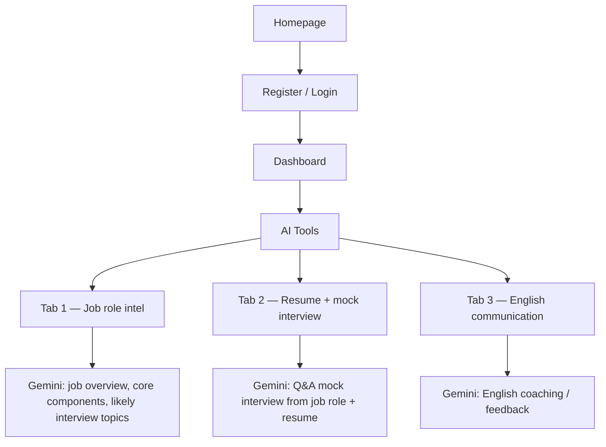

---

# System Requirements: Professor X AI Interview Platform

## 1. Project Overview

"Professor X" is an AI-powered interview platform designed to simulate real-time interview experiences and automate candidate evaluation using the MERN stack. **Interview questions are generated exclusively via the Google Gemini API** (no static question banks or other LLM providers for question text). The system records responses and provides instant feedback on communication skills, accuracy, and confidence.

Core product areas: **job-role intelligence**, **resume-aware mock interviews** (text-to-text), and **English communication support** — all routed through Gemini on the backend.

## 2. Technical Stack (MERN)

The application follows a three-tier architecture:

* **Frontend:** React.js for an interactive, component-based user interface.
* **Backend:** Node.js and Express.js for server-side logic and API handling.
* **Database:** MongoDB (NoSQL) for storing user data, session history (including persisted copies of questions shown), and performance metrics.
* **Question generation:** Google **Gemini** only — the backend calls the Gemini API to produce questions from context such as difficulty and job role; the client never holds the API key.
* **Styling:** Bootstrap 5 (Sandstone theme) as a base; **UI must stay minimal** with clear emphasis on AI-powered sections (see §3).

## 3. User Flow & UI Principles

### 3.1 User flow (high level)

Users start at the **homepage**, then **register** or **log in**, land on the **dashboard**, and open **AI Tools** (one surface with **three tabs**). All Gemini-backed outputs should be visually distinct so users immediately see where AI is working.



Linear journey (same story without branches):

```text
Homepage → Register or Login → Dashboard → AI Tools
              ├── Tab 1: job role (+ optional description) → AI-generated job intel
              ├── Tab 2: job role + resume upload → text-to-text mock interview
              └── Tab 3: English communication help
```

### 3.2 UI principles

* **Minimal chrome:** Few navigation items, generous whitespace, short copy. Avoid dense dashboards unrelated to the three AI flows.
* **Highlight AI:** Use a consistent pattern for AI-generated content (e.g., labeled panel, subtle accent border or icon, loading state while Gemini responds). Primary actions are “Generate” / “Send” / “Next question” — not decorative flourishes.
* **Progressive disclosure:** Show only the fields needed for the active tab; keep job role entry and file upload obvious and uncluttered.

## 4. Functional Requirements

### User Management

* **Authentication:** Users must be able to register and log in via secure credentials.
* **Profile:** Users can view and edit personal and professional details.

### Homepage

* **Landing:** Explains the product in brief; primary calls-to-action lead to **Register** and **Login**.

### Dashboard

* **Hub:** After login, users see a compact summary (e.g., recent activity or shortcuts) and a clear entry point to **AI Tools**. Optional high-level stats may appear but must not dominate the minimal layout.

### AI Tools (single area, three tabs)

1. **Tab 1 — Job role intelligence**  
   * Inputs: **job role** (required), **job description** (optional).  
   * Output (via **Gemini**): structured or narrative content covering **what the job entails**, **core components / skills**, and **themes or topics likely to appear in interviews** for that role.

2. **Tab 2 — Mock text interview**  
   * Inputs: **job role** (text, aligned with Tab 1 or pasted for this session), **resume** (upload; parsed text sent server-side for prompting — no client-side key).  
   * Behavior: **text-to-text** mock interview — user and model exchange messages; **questions and follow-ups come from Gemini** grounded in role + resume content.  
   * Response handling, progress (e.g., question count or phase), and optional timer as in the interview module below.

3. **Tab 3 — English communication**  
   * Dedicated flow to **practice or improve English** for professional contexts (e.g., phrasing feedback, corrections, suggested rewrites) — powered by **Gemini**, separate from the mock interview tab so the mental model stays clear.

### Interview Module (within Tab 2 and shared patterns)

* **Dynamic Questioning:** Every interview question the candidate sees in the mock flow is **requested from Google Gemini** at runtime (parameterized by job role, resume-derived context, and prior answers as needed). The database is not the source of question text; it may only store a record of what was asked for auditing and analytics.
* **Response Handling:** The system must capture text-based responses for AI evaluation.
* **Progress Tracking:** Includes a "Question Progress" bar and "Time Elapsed" timer where applicable.

### AI & Analytics

* **Evaluation:** AI/NLP evaluates response quality, accuracy, and confidence. **Interview questions are always produced by Gemini**; evaluation logic is separate and may use Gemini or other agreed approaches without changing the question source.
* **Dashboard metrics:** Displays useful aggregates (e.g., "Total Interviews," "Success Rate," "Average Score") without crowding the main AI Tools experience.
* **Performance Trends:** Visualizes improvement over time using charts (e.g., `recharts`).

## 5. Database Schema (MongoDB Collections)

* **Users:** `ID, Name, Email, Password`.
* **Interviews:** `ID, Date, Score`.
* **Questions (archive):** `ID, Text, Difficulty, InterviewID, Source` — stores questions **after** they are generated by Gemini for history and reporting (`Source` records Gemini / model metadata).
* **Responses:** `Answer, Timestamp`.
* **Results:** `Score, Feedback`.
* **Job analyses (optional):** Persist Tab 1 outputs per user/session for history (`Role, DescriptionSnippet, GeneratedSummary, CreatedAt`).
* **Resume metadata (optional):** Store filename, upload time, and reference to extracted text or object storage key — **not** the API key.

## 6. System Architecture

1. **Presentation Layer:** React components for homepage, auth, dashboard, and **AI Tools** (tabbed layout with minimal styling and prominent AI result regions).
2. **Application Layer:** Node.js server handling REST API requests; a **Gemini client module** is the sole path for generating new interview questions and the other Tab 1–3 generations (timeouts, retries, and safe parsing of model output live here). File upload handling and text extraction for resumes occur server-side before prompting.
3. **Data Layer:** MongoDB for persistent storage of all session data.

## 7. Containerization (Docker)

The platform is designed to run as multiple containers orchestrated with **Docker Compose** for local development and as a blueprint for production (same images, different orchestration if needed).

### 7.1 Service Topology

| Service | Role | Typical image / base |
|--------|------|----------------------|
| **mongo** | Primary database | Official `mongo` image (LTS tag aligned with project policy). |
| **api** | Express REST API, AI proxy logic | Node LTS on Alpine or Debian-slim; application code + production dependencies only. |
| **web** | React UI | **Development:** Node image serving Vite/Webpack dev server with hot reload. **Production:** multi-stage build: build stage (Node) → static assets served by **nginx** (or embedded static hosting behind the API reverse proxy). |

Containers communicate on an internal Docker network. The database port does not need to be published publicly in production; only `api` (and optionally `web`) expose host-facing ports.

### 7.2 Persistence & State

* **MongoDB data:** Named volume (e.g., `mongo_data`) mounted at the container’s data directory so restarts and image upgrades do not wipe the database.
* **Ephemeral:** Container filesystems for `api` and `web` (except any explicit upload volumes if file storage is added later).

### 7.3 Configuration & Secrets

* **Environment variables** (examples): database URI or `MONGO_HOST` / `MONGO_PORT`, JWT or session secrets, **`GEMINI_API_KEY`** (required for question generation), optional `GEMINI_MODEL` / region settings, `NODE_ENV`, CORS origins, public API base URL for the frontend build.
* **Compose:** Use an `.env` file (git-ignored) or a secrets mechanism in production; never bake secrets into images.
* **Frontend:** Build-time variables for public API URL (`REACT_APP_*`, `VITE_*`, etc., depending on the toolchain).

### 7.4 Dockerfiles (Conventions)

* **API:** Copy `package.json` / lockfile, `npm ci --omit=dev`, copy source, `USER` non-root, `EXPOSE` the HTTP port the app listens on, `CMD` to start the server.
* **Web (production):** Stage 1 — install and `npm run build`. Stage 2 — copy build output into nginx (or distroless static server) with a minimal default config and SPA fallback to `index.html` if using client-side routing.
* **`.dockerignore`:** Exclude `node_modules`, `.git`, local env files, tests artifacts, and IDE folders to keep builds fast and images small.

### 7.5 Local Development vs Production

* **Local:** Compose brings up `mongo`, `api`, and `web` with bind mounts for source code where appropriate so edits reflect without rebuilding; dev server port mapped to the host.
* **Production:** Immutable images tagged by version; no bind mounts; healthchecks on `api` and `mongo`; optional reverse proxy (Traefik, Caddy, or cloud load balancer) in front of `web` and `api` for TLS and routing.

### 7.6 Health & Operations

* **Healthchecks:** HTTP check on the API `/health` or equivalent; `mongo` using `mongosh` ping or the image’s documented pattern.
* **Logs:** Structured logging from `api` to stdout/stderr for collection by the container runtime.
* **Scaling:** Stateless `api` and `web` replicas behind a load balancer; single writable MongoDB instance or a managed MongoDB service for HA.

## 8. Development & Deployment Tools

* **Version Control:** Git & GitHub.
* **API Testing:** Postman.
* **Environment:** Node Package Manager (NPM) for dependency management.
* **Containers:** Docker and Docker Compose for repeatable environments and deployment artifacts.
* **IDE:** Visual Studio Code.

## 9. Performance & Security

* **Feasibility:** Use open-source tools to ensure economic feasibility.
* **Risks:** Mitigation strategies include secure authentication, **keeping `GEMINI_API_KEY` server-only**, rate limiting Gemini calls, and validating model output before showing questions to users.
* **Containers:** Run application processes as non-root, keep base images patched, scan images in CI, and restrict network exposure (database internal-only).
* **Uploads:** Validate file types and size for resume uploads; scan or sandbox extraction as policy requires; never send raw files to the browser for direct third-party API calls.

---
