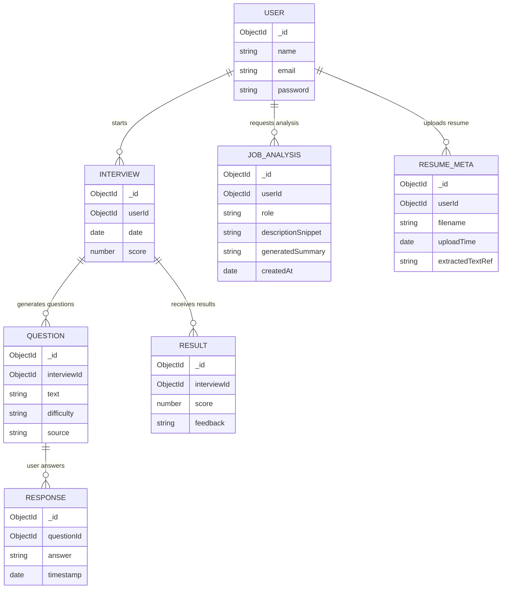

```mermaid
erDiagram
    USER ||--o{ INTERVIEW : starts
    USER ||--o{ JOB_ANALYSIS : "requests analysis"
    USER ||--o{ RESUME_META : "uploads resume"
    INTERVIEW ||--o{ QUESTION : "generates questions"
    INTERVIEW ||--o{ RESULT : "receives results"
    QUESTION ||--o{ RESPONSE : "user answers"
    
    USER {
        ObjectId _id
        string name
        string email
        string password
    }
    
    INTERVIEW {
        ObjectId _id
        ObjectId userId
        date date
        number score
    }
    
    JOB_ANALYSIS {
        ObjectId _id
        ObjectId userId
        string role
        string descriptionSnippet
        string generatedSummary
        date createdAt
    }
    
    RESUME_META {
        ObjectId _id
        ObjectId userId
        string filename
        date uploadTime
        string extractedTextRef
    }
    
    QUESTION {
        ObjectId _id
        ObjectId interviewId
        string text
        string difficulty
        string source
    }
    
    RESPONSE {
        ObjectId _id
        ObjectId questionId
        string answer
        date timestamp
    }
    
    RESULT {
        ObjectId _id
        ObjectId interviewId
        number score
        string feedback
    }
```
