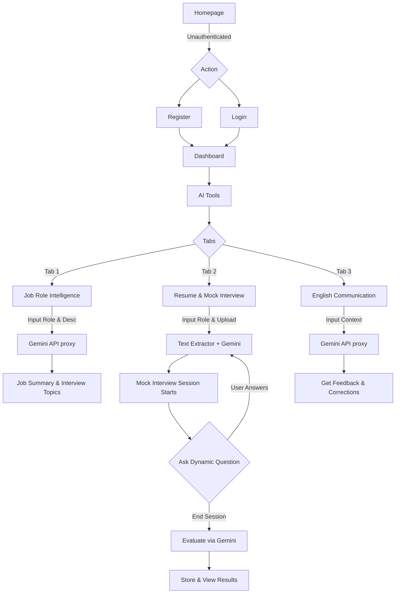

```mermaid
flowchart TD
    A[Homepage] -->|Unauthenticated| B{Action}
    B --> C[Register]
    B --> D[Login]
    C --> E[Dashboard]
    D --> E
    E --> F[AI Tools]
    
    F --> G{Tabs}
    
    G -->|Tab 1| H[Job Role Intelligence]
    H -->|Input Role & Desc| I[Gemini API proxy]
    I --> J[Job Summary & Interview Topics]
    
    G -->|Tab 2| K[Resume & Mock Interview]
    K -->|Input Role & Upload| L[Text Extractor + Gemini]
    L --> M[Mock Interview Session Starts]
    M --> N{Ask Dynamic Question}
    N -->|User Answers| L
    N -->|End Session| O[Evaluate via Gemini]
    O --> P[Store & View Results]
    
    G -->|Tab 3| Q[English Communication]
    Q -->|Input Context| R[Gemini API proxy]
    R --> S[Get Feedback & Corrections]
```
